  

# Hola, soy Miguel 👋

**Full Stack Developer** · React · Vue 3 · Next.js · NestJS · Supabase · TypeScript  
Lima, Perú 🇵🇪 · [Portfolio](https://mijel-website.vercel.app/) · [LinkedIn](https://www.linkedin.com/in/mijeldev/) · [YouTube](https://www.youtube.com/@mijeldev)

---

## Sobre mí

Desarrollador Full Stack con más de 3 años de experiencia construyendo sistemas reales para empresas.  
Especializado en **Frontend** (React, Next.js, Vue 3) con sólida base en **Backend** (NestJS, Express, Supabase).

He desarrollado sistemas de gestión interna, flujos de aprobación, chat en tiempo real y aplicaciones con IA, todos en producción.

Actualmente estudio Ingeniería de Sistemas en la **Universidad Nacional Federico Villarreal** (4to año) y me preparo para la certificación **AWS Cloud Practitioner**.

También comparto contenido técnico en español en mi [canal de YouTube](https://www.youtube.com/@mijeldev).

---

## Proyectos destacados

### [Flowly](https://creador-flujos-nextjs.vercel.app/) — Generador de workflows con IA
> Crea flujos de trabajo estructurados a partir de descripciones en lenguaje natural.

`Next.js` `TypeScript` `IA` `Supabase` `Vercel`

### [Loom](https://loom-doc.vercel.app/) — Editor Markdown con Git
> Aplicación de escritorio inspirada en Obsidian, orientada a desarrolladores y escritores.

`React Native` `React 18` `TypeScript` `Tailwind CSS` `Git/SSH`

- Clone, pull, push y commit desde la app  
- Editor Markdown con scroll sincronizado  
- Terminal integrada  
- Documentación completa (ES/EN)

### Sistemas corporativos @ IBIT *(repos privados)*
Sistemas reales desarrollados para clientes:

- **UTP** — Módulos de gestión universitaria (React + NestJS)
- **PCR** — Gestión de archivos + flujos de aprobación + chat en tiempo real (WebSockets)
- **Layher** — Sistema de gestión personalizado (Vue 3 + TypeScript)

---

## Tech Stack

**Frontend**  

**Backend**  

**Cloud, CI/CD & Tools**  

---

## GitHub Stats

  
  

---

## Contacto

¿Quieres colaborar, hablar de tecnología o simplemente saludar?

- [LinkedIn](https://www.linkedin.com/in/mijeldev/)
- [Portfolio](https://mijel-website.vercel.app/)
- miguel.dev@gmail.com
- [YouTube](https://www.youtube.com/@mijeldev)

---

  

